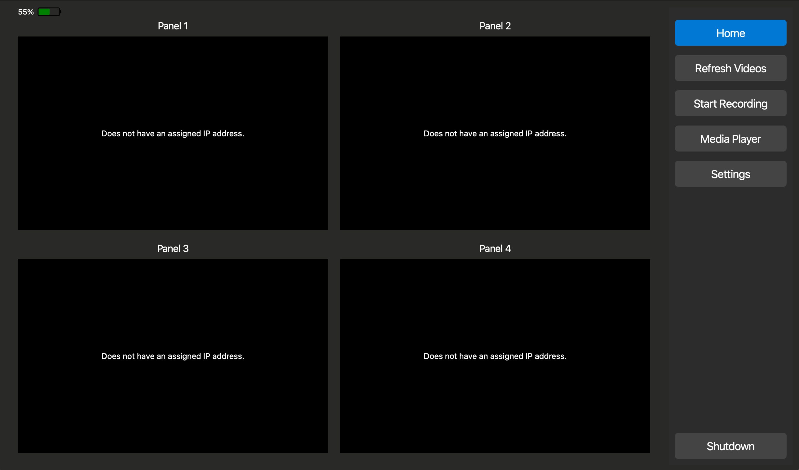
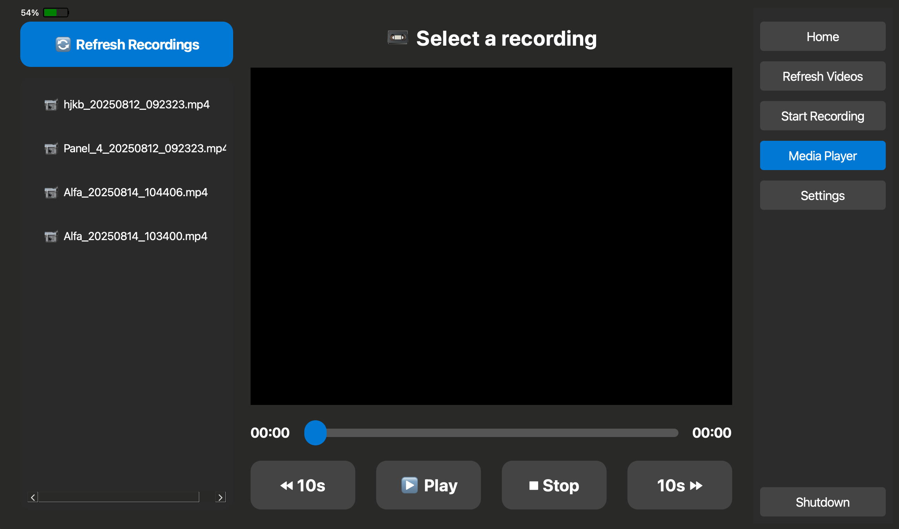
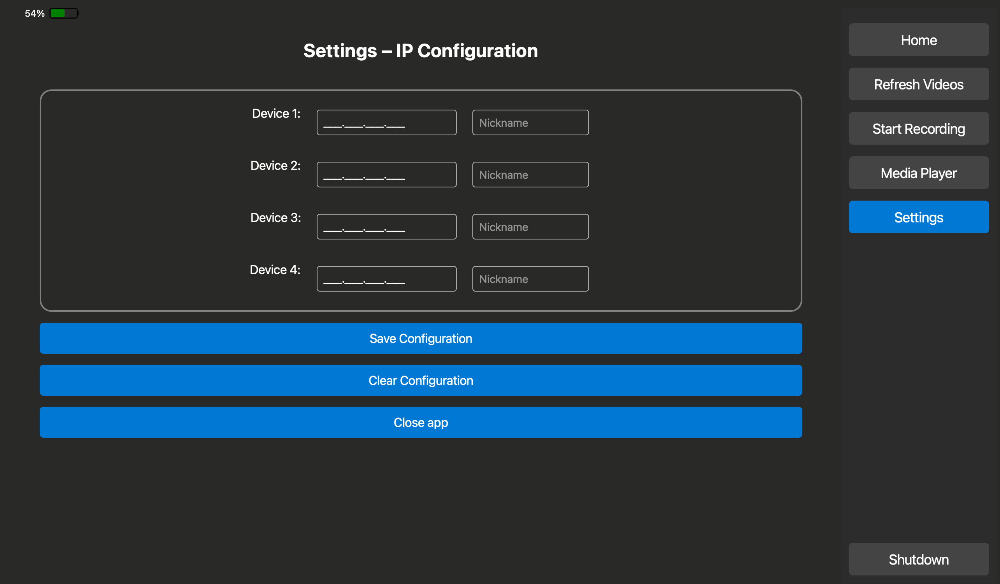

# Vision Hub App

**Real-time multi-camera monitoring & recording app for Axis video encoder network cameras, built with PySide6/Qt and optimized for touchscreen tablets.**

---

## 📖 Overview

Axis Multi-Cam Monitor is a desktop application for **real-time IP camera monitoring**, **multi-stream recording**, and **video playback** — specifically designed for **Axis video encoder network cameras**.  
It features a **tablet-friendly UI** with large, touch-optimized controls, a **dark high-contrast theme** for low-light environments, and **multi-camera live view** for security, marine, and robotics operations.

---

## ✨ Features

- **📡 Multi-Camera Live View**
  - Displays multiple Axis camera feeds in a grid layout.
  - Tap/double-click to zoom into a single feed.

- **⏺ One-Tap Recording Control**
  - Start/stop recording across all panels with one button.
  - Red dot indicator shows recording status.

- **🔄 Debounced Video Refresh**
  - Refresh all camera feeds without freezing the UI.
  - Built-in click debounce to prevent overload.

- **🎥 Media Player**
  - Browse recorded videos in a tablet-optimized player.
  - Play, pause, stop, skip forward/backward, and scrub through recordings.

- **🔒 Secure Settings Access**
  - PIN-protected settings page for device configuration.

- **🔋 Battery Status Widget**
  - Always-visible battery indicator for portable use.

- **⏻ System Shutdown Control**
  - Shutdown from within the app (supports Windows, Linux, macOS).

---

## 📷 Screenshots

```





````

---

## 🛠 Installation

### 1. Clone the Repository
```bash
git clone https://github.com/efraimG21/vision-hub.git
cd vision-hub
````

### 2. Create a Virtual Environment (Recommended)

```bash
python -m venv venv
source venv/bin/activate   # On macOS/Linux
venv\Scripts\activate      # On Windows
```

### 3. Install Dependencies

```bash
pip install -r requirements.txt
```

---

## 🚀 Usage

### Run the Application

```bash
python main.py
```

### Default Admin PIN

* **`1234`** (can be changed in the settings page).

---

## ⚙️ Configuration

The app stores settings using `QSettings`:

* Camera IP addresses and nicknames
* Admin PIN
* Other device configuration

Recorded videos are stored in:

```
RECORDINGS_DIR/
```

---

## 🖥 Tested Platforms

* Windows 10/11
* macOS (Intel & Apple Silicon)

---

## 📜 License

This project is licensed under the MIT License — see the [LICENSE](LICENSE) file for details.

---

## 🤝 Contributing

Pull requests are welcome! Please open an issue first to discuss proposed changes.

---


